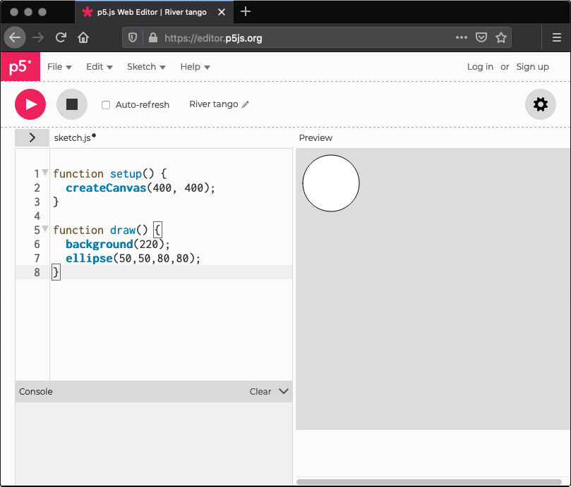

## 柴树杉

凹语言在2022年实验性地支持了 [实现了点亮 Arduino Nano 33 的 LED](https://wa-lang.org/smalltalk/st0015.html) 的操作，为爱好者使用凹语言开发创意硬件提供了可能。比如下面的代码：

```wa
# 版权 @2022 凹语言 作者。保留所有权利。

import "syscall/arduino"

var LED = arduino.GetPinLED()

func init {
	arduino.PinMode(LED, 1)
	arduino.Print("凹语言(Wa)/Arduino is running ...\n")
}

func main {
	for {
		arduino.DigitalWrite(LED, arduino.HIGH)
		arduino.Delay(100)
		arduino.DigitalWrite(LED, arduino.LOW)
		arduino.Delay(900)
	}
}
```

Arduino 原本的程序采用的是 Processing 语言风格，对应下面更为简洁的方式：

```c
void setup {
	pinMode(LED_BUILTIN, OUTPUT)
	print("凹语言(Wa)/Arduino is running ...\n")
}

void loop {
	digitalWrite(LED_BUILTIN, HIGH)
	delay(100)
	digitalWrite(LED_BUILTIN, LOW)
	delay(900)
}
```

对于儿童或非专业软件开发同学，上述代码更为简单：setup 负责初始化，loop 负责循环刷新 LED 状态。

最早的 Processing 其实是 Java 实现的，而且面向的是画布输出。后来出现了 Python、JavaScript 等不同语言的实现。比如下面是 JavaScript 实现的 p5.js 的例子：

```js
function setup() {
    createCanvas(400, 400);
}

function draw() {
    background(220);
    ellipse(50,50,80,80);
}
```

和 Arduino 的代码结构类似：setup 函数负责初始化，createCanvas 创建一个画布；draw 负责在画布上画一个圆。执行效果如下：



而凹语言作为一个为 WebAssembly 设计的语言，天生就对 Web 环境友好。目前实现的 [Playground](https://wa-lang.org/playground/) 和 [贪吃蛇游戏](https://wa-lang.org/smalltalk/st0018.html) 游戏就在纯浏览器执行的。如果能够借鉴 p5.js 的 Web 编辑器环境，实现在凹语言的 Playground 中编写并执行 贪吃蛇 游戏将会极大提高用户体验。

因此，倡议为凹语言提供一个类似画布的能力，最终实现在 Playground 中开发类似 p5.js 程序或 贪吃蛇游戏。同时也可以借此完善标准库的建设。希望大家积极、充分发表看法，以及（不限于）技术路线的选择和优劣讨论。

***

> ## 丁尔男
> 
> 建议将“以凹实现一套图形库”为目标，而不是仅将网页的 Canvas 包装成凹风格的 API，原因在于：
> 
> 1. 后者只会产生与运行环境高度绑定的胶水代码，很难形成有复用价值的库；
> 1. 前者可以不依赖于网页，应用场景想象空间更大。
> 
> 从实施来说，可以分成两个阶段：
> 
> 1. 实现立即模式基本功能，包括：帧缓存管理、图元光栅化、位图操作及填充等，立即模式的 API 是指令式的；  
> 1. 基于立即模式开发托管模式。托管模式可以提供图元的对象化管理，在图形库层面提供图元选中判断等高级能力。
> 
> 第一阶段的难度其实更大一些，因为涉及很多图形学内容，可以先胶水 Canvas，后逐渐改为内部实现，以降低启动阻力。
> 
> ***